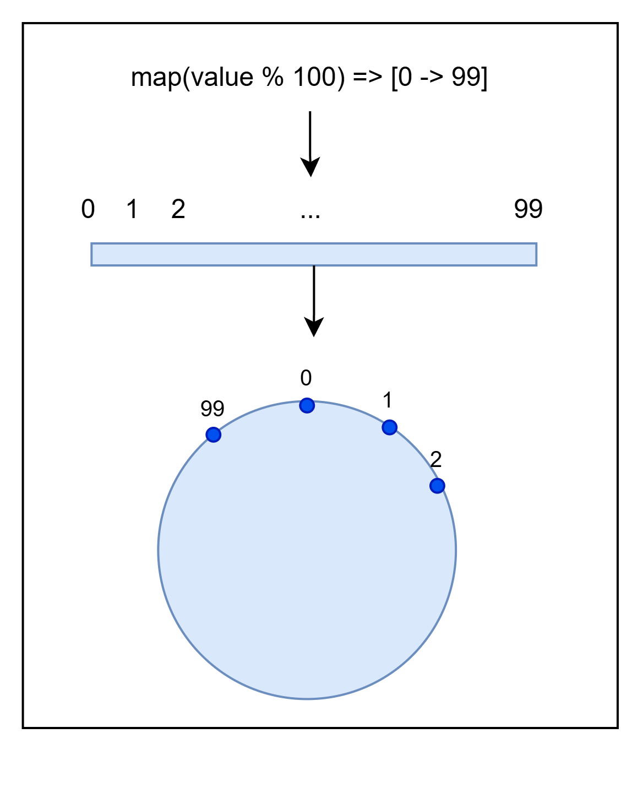
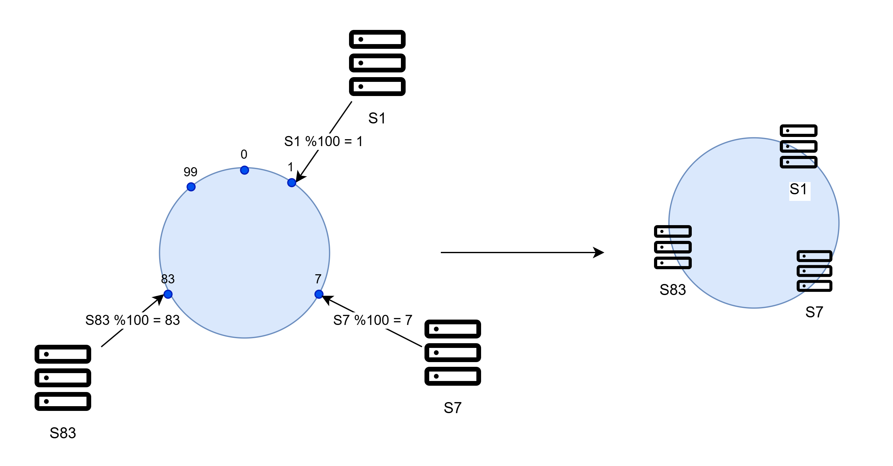
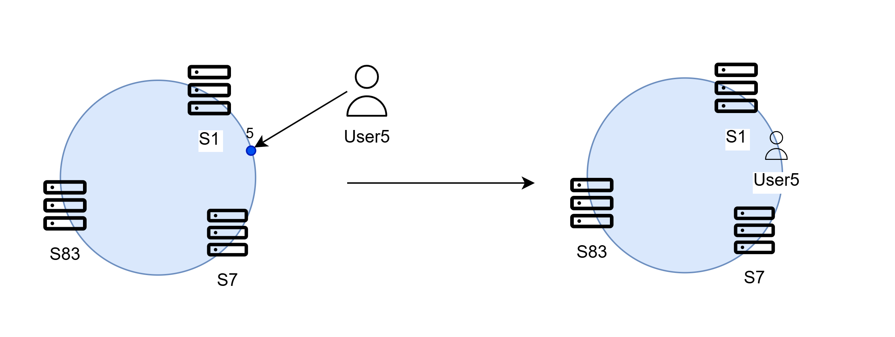
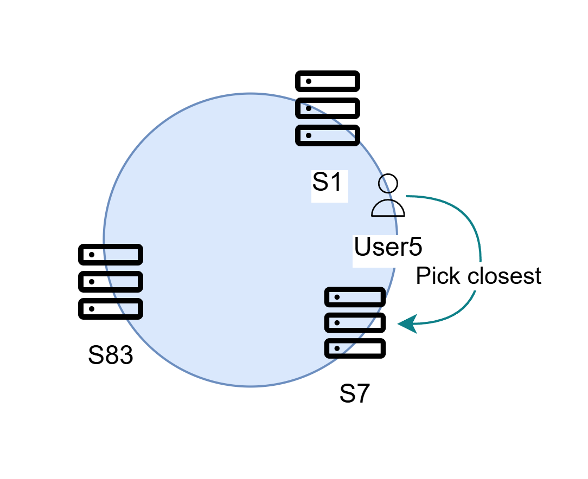
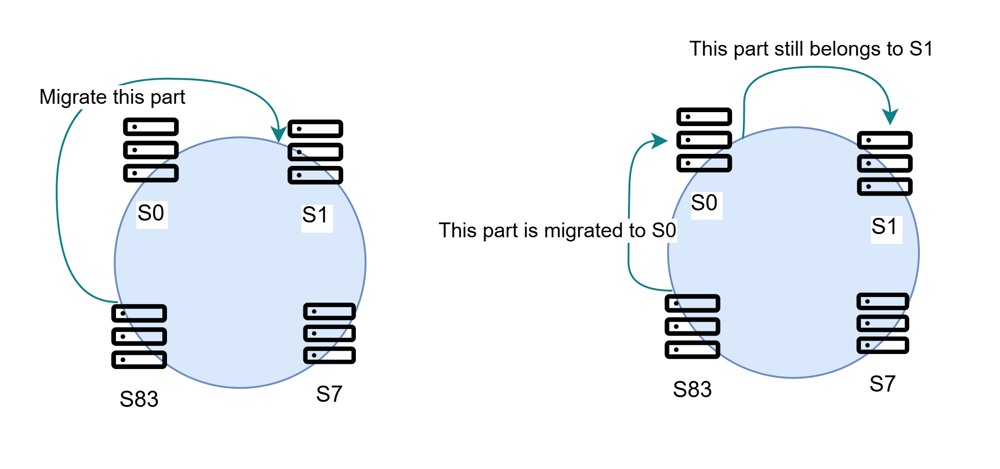
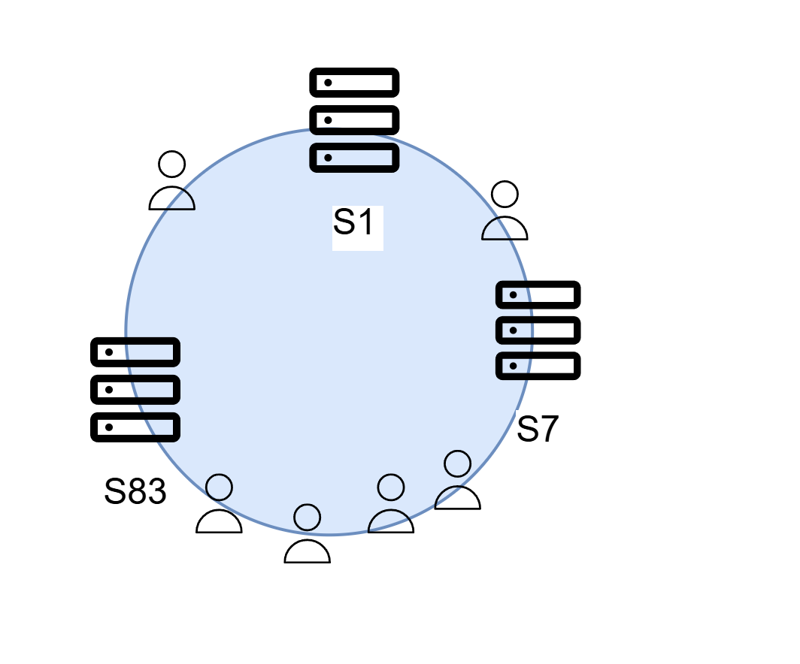
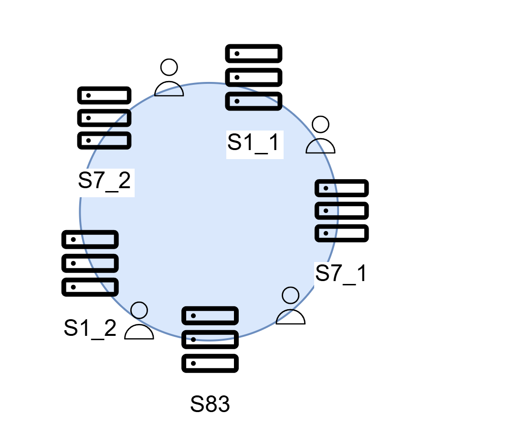
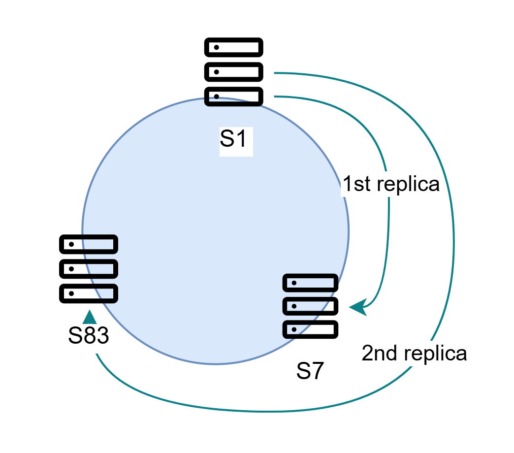

In terms of high availability and resiliency,
the  model is not ideal because the master server holds too much centralized power.

By contrast,  **Architecture** adopts a distributed model,
where the system is operated cooperatively by multiple servers,
each sharing **equal responsibility**. These servers are referred to as **peers** (or nodes).

## Data Ownership

Conceptually, the database is divided into multiple **shards**, each managed by a peer.

For instance, a database might be split into three shards, each assigned to a separate server.

```d2

classes: {
  part: {
    width: 200
  }
}
grid-columns: 1
db: Database {
  direction: right
  width: 600
  grid-gap: 0
  grid-columns: 3
  p1: Shard 1 {
    class: part
  }
  p2: Shard 2 {
    class: part
  }
  p3: Shard 3 {
    class: part
  }
}
sv: "" {
  direction: right
  grid-columns: 3
  s1: Server 1 {
    class: db
  }
  s2: Server 2 {
    class: db
  }
  s3: Server 3 {
    class: db
  }
}

db.p1 -> sv.s1
db.p2 -> sv.s2
db.p3 -> sv.s3
```

Each peer is responsible for managing a portion of the database.
Even if some of them go down, only the respective shards become unavailable,
while the rest of the system remains fully functional.

Importantly, we are **not** splitting the database into large storage blocks and distributing them across servers.
Instead, a more granular approach is used: each individual record is assigned to a peer based on its **unique key** and a **mapper function**.

For example, consider a set of user records identified by `userId` (an integer):

- Suppose the system has three servers, with `serverId` values from `0 to 2`.
- The mapper function is defined as: `ownerServerId = userId % numberOfServers(3)`.

```d2
grid-columns: 1
db: Databases {
  grid-columns: 3
  s0: Server 0 {
    class: db
  }
  s1: Server 1 {
    class: db
  }
  s2: Server 2 {
    class: db
  }
}
re: "" {
  grid-columns: 4
  u0: User 0 {
    shape: sql_table
    id: 0 {constraint: primary_key}
    name: John
  }
  u1: User 1 {
    shape: sql_table
    id: 1 {constraint: primary_key}
    name: Filip
  }
  u4: User 4 {
    shape: sql_table
    id: 4 {constraint: primary_key}
    name: Mike
  }
  u2: User 2 {
    shape: sql_table
    id: 2 {constraint: primary_key}
    name: Ann
  }
}
re.u0 -> db.s0: "0 % 3 = 0 (S0)" {
  style.bold: true
}
re.u1 -> db.s1: "1 % 3 = 1 (S1)" {
  style.bold: true
}
re.u4 -> db.s1: "4 % 3 = 1 (S1)" {
  style.bold: true
}
re.u2 -> db.s2: "2 % 3 = 2 (S2)" {
  style.bold: true
}
```

Each server handles reading and writing for its corresponding records, ensuring improved availability.
Additionally, when user keys increase linearly, storage volume is evenly distributed among peers, leading to efficient resource balancing.

However, this solution becomes problematic when the number of servers changes.
Adding new servers requires updating the mapper function,
and previously stored data may become unreachable because it was mapped using the old function.

In the example above, if we expand to four servers and change the mapper to `userId % numberOfServers(4)`:

- To locate `User 4`, we calculate `4 % 4 = 0 (Server 0)`,
yet the data for `User 4` was previously stored on `4 % 3 = 1 (Server 1)`.
- Correcting this would require inefficiently **rehashing** and migrating the entire database.

## Consistent Hashing

As demonstrated,
traditional hashing tightly couples the number of servers to the data mapping,
making it brittle during server changes.
To address this, we use a technique called ,
which decouples records from the number of servers by mapping them onto a fixed, consistent range.

It’s easier to understand through an example:

{}

### Virtual Ring

First, we define a **hash function** that returns a value within a fixed range, `[0, N]`:
`map(value) -> output in [0, N]`.

This range is conceptualized as a **ring**, wrapping values from `N` back to `0`.

For instance, we can use `value % 100` to map values to `[0 → 99]`, forming a circular virtual ring:



### Placing servers

Next, we **place servers** onto the ring by hashing their server IDs.
Each server occupies a specific, predictable point on the ring.



### Placing records

We **hash record keys** using the same function and place them onto the ring.



To determine a record’s **owner server**,
we scan clockwise (or counterclockwise) around the ring from the record’s position.
The first server we encounter is assigned ownership.



{}

### Improvements

Does consistent hashing completely solve the rehashing problem?
No, but it **greatly mitigates** the issue.

For example,
when a new server (e.g., `S0`) is added,
only a portion of the data from neighboring servers (`S1` and `S83`) needs to be migrated,
rather than the entire database.



Thus, consistent hashing avoids the need to remap the entire database when scaling out.

## Virtual Nodes

One remaining issue with  is imbalance.
Real-world data distributions can cause **hotspots**:
some servers become overloaded while others remain underutilized.

For example, `S83` may be under stress with a large number of records, while the other servers remain idle.



There are two main causes of the imbalance:

- A poor hash function that fails to distribute values evenly.
- A ring that is too sparse for the number of servers, creating large gaps.

To address these issues, servers can be assigned **multiple virtual nodes** on the ring.



Each physical server is represented by multiple virtual IDs,
reducing gaps and achieving a more balanced distribution.

However, using too many virtual nodes increases system complexity,
particularly during data migration.
For example, when removing a server from the cluster,
we must also migrate the data associated with **all** of its virtual nodes.
This process can involve a large number of physical servers, significantly increasing the migration workload.

## Shard Replication

Allowing shards to reside on only one server is risky.
If that server crashes without recovery, the shard and its data will be lost.

Thus, we must introduce **replication**:

- Each shard has one **primary** owner and multiple **replicas** stored on different servers.
- The number of replicas for each shard is commonly referred to as the **Replication Factor**.
- Replica shards can independently serve read queries, enhancing both availability and performance.

For example, with `3` shards and a replication factor of `2`:

- `Server 1` holds `Shard 1 (primary)` and `Shard 2 (replica)`.
- `Server 2` holds `Shard 2 (primary)` and `Shard 3 (replica)`.
- `Server 3` holds `Shard 3 (primary)` and `Shard 1 (replica)`.

```d2
classes: {
  part: {
      width: 315
  }
}
grid-columns: 1
db: Virtually original database {
  direction: right
  grid-gap: 0
  grid-columns: 3
  p1: Shard 1 {
    class: part
  }
  p2: Shard 2 {
    class: part
  }
  p3: Shard 3 {
    class: part
  }
}

peer: Peer-to-peer cluster {
  s1: "Server 1" {
    grid-gap: 50
    grid-columns: 1
    p1: Shard 1 primary
    p2: Shard 2 replica
  }
  s2: "Server 2" {
    grid-gap: 50
    grid-columns: 1
    p1: Shard 2 primary
    p2: Shard 3 replica
  }
  s3: "Server 3" {
    grid-gap: 50
    grid-columns: 1
    p1: Shard 3 primary
    p2: Shard 1 replica
  }
  s1.p1 -> s3.p2: Replicate {
    style.animated: true
  }
  s2.p1 -> s1.p2: Replicate {
    style.animated: true
  }
  s3.p1 -> s2.p2: Replicate {
    style.animated: true
  }
}
db.p1 -> peer.s1.p1
db.p2 -> peer.s2.p1
db.p3 -> peer.s3.p1
```

### How Are Replicas Chosen?

A simple strategy is to pick the next servers clockwise on the ring.



Some systems strengthen this further by considering **infrastructure diversity** —
for example, placing replicas across different data centers or regions to guard against localized failures.

## Master-Slave And Peer-to-peer

 brings about simplicity.
However, the master server becomes the system's single point of failure,
and reliance on it significantly degrades the system’s availability.

 provides a more flexible and highly available cluster,
making nodes inside a cluster equally important.
However, maintaining consistency across peers becomes increasingly difficult as the network scales.
For highly coupled data models like , this approach can be challenging.
Data is scattered across multiple servers, and actions like **transactions** or **joins**
across many servers over the network become extremely costly and, at times, impossible.

In fact, many  databases treat the  model as their native setup.
On the other hand,  databases, which avoid joins and transactions, use 
for high availability and fault tolerance.

## Decentralized Cluster

We have extensively discussed data sharding and replication.
Now, the question arises: *how can we effectively combine them into a single virtual database?*

Maintaining a  system is no simple task.
This architecture embraces decentralization, aiming for high availability and fault tolerance,
with **no single point of failure**.

A decentralized cluster must ensure that metadata (e.g., member addresses, sharding information, etc.)
is both reliable and consistently shared across all members.
This consistency is critical for enabling operations like replication, sharding, and promotion.

```d2
direction: right
p1: Peer 1 {
    class: server
}
p2: Peer 2 {
    class: server
}
p3: Peer 3 {
    class: server
}
p1 <-> p2 {
    style.animated: true
}
p2 <-> p3 {
    style.animated: true
}
p1 <-> p3 {
    style.animated: true
}
```

### Distributed Properties

Before moving forward, we need to explore the **CAP Theorem**,
a fundamental trade-off that governs distributed systems.

Distributed systems are essentially characterized by three key properties:
**Consistency**, **Availability** and **Partition Tolerance**.

#### 1. Consistency (C)

**Consistency** in the context of 
means that all nodes see the same data at the same time,
either immediately or eventually through synchronization mechanisms.

#### 2. Availability (A)

**Availability (A)** —
as discussed in the [Service Cluster]() section —
ensures that every request receives a response,
even if the response contains outdated or inconsistent data.
In short, a system is considered **available** as long as it responds, regardless of accuracy.


We've only briefly touched on **Consistency** and **Availability** here;
deeper explanations will follow in the sections below.


#### 3. Partition Tolerance (P)

To understand **Partition Tolerance**, we first need to grasp the concept of a **Partition**:

##### Network Partition

A **network partition** occurs when failures split a cluster into isolated groups of nodes,
preventing them from communicating with one another.

For example, consider a cluster of three servers that constantly cooperate to maintain synchronization:

```d2
direction: right
sa: Server A {
  class: server
}
sb: Server B {
  class: server
}
sc: Server C {
  class: server
}
sa <-> sb {
  style.animated: true
}
sb <-> sc {
  style.animated: true
}
sc <-> sa {
  style.animated: true
}
```

Now imagine a network failure disrupts communication between `Server C` and the others:
The cluster splits into two isolated partitions: `Partition 1 (A, B)` and `Partition 2 (C)`.

```d2
grid-rows: 2
c1: "" {
  direction: right
  sa: Server A {
    class: server
  }
  sb: Server B {
    class: server
  }
  sc: Server C {
    class: server
  }
  sa <-> sb
  sc <-> sa: Disconnect {
    class: error-conn
  }
  sc <-> sb: Disconnect {
    class: error-conn
  }
}
c2: "Network partition" {
  grid-rows: 1
  g1: Partition 1 {
    grid-rows: 1
    horizontal-gap: 100
    sa: Server A {
        class: server
    }
    sb: Server B {
        class: server
    }
    sa <-> sb
  }
  g2: Partition 2 {
    sc: Server C {
        class: server
    }
  }
}
c1 -> c2
```

**Partition Tolerance (P)** is a system’s ability to continue functioning correctly despite these network partitions.

## CAP Theorem

The **CAP theorem** states that a distributed database can satisfy **only two**
of the following three properties simultaneously: **Consistency**, **Availability**, and **Partition Tolerance**.

Thus, practical systems must choose between three design patterns: **AP**, **CP**, or **CA**.

### CA System

A **CA** system provides **Consistency** and **Availability** but not **Partition Tolerance**.
In theory, this sounds ideal, but in practice, it’s **impractical**.

When a network partition occurs, a **CA** system would either stop working entirely or behave incorrectly —
both outcomes are unacceptable.
Since network partitions are inevitable in real-world environments,
a system that does not tolerate partitions is essentially unusable.

Thus, the real-world battle comes down to **AP** vs **CP**.
In the presence of a partition, a distributed system must choose between **Consistency** and **Availability**.

### CP (Consistency over Availability) System

Consider a cluster of two servers:

- `A` hosts `Shard 1`; `B` maintains a replica of it.
- If clients write to `Shard 1` via `B`, `B` forwards the request to `A` (the shard owner).

```d2
client: Client {
    class: client
}
c: Cluster {
  grid-rows: 1
  horizontal-gap: 200
  sb: Server B {
    s: Replica 1
  }
  sa: Server A {
    s: Shard 1
  }
}
client -> c.sb: '1. Write to "Shard 1"'
c.sb -> c.sa: "2. Forward to the primary"
```

Suppose a network partition occurs, separating `A` from `B`.
Now, clients connecting to `B` can **only read** from the replica — **writes are disabled** to preserve consistency.

```d2
grid-rows: 2
client: Client {
    class: client
}
c: Cluster {
  grid-rows: 1
  horizontal-gap: 200
  g1: Partition 1 {
      sa: Server A {
          s: Shard 1
      }
  }
  g2: Partition 2 {
      sb: Server B {
          s: Replica 1
      }
  }
  g1.sa <-> g2.sb: Disconnected {
      class: error-conn
      style.animated: true
  }
}
client -> c.g1.sa : Read and write {
  style.bold: true
}
client -> c.g2.sb: Read only {
  style.bold: true
}
```

This is a **CP** system:
it prioritizes **Consistency** over **Availability**, sacrificing write operations on isolated replicas.

### AP (Availability over Consistency) System

Now, let's modify the previous example to favor **Availability**.
Instead of disabling writes, `B` temporarily accepts writes even while partitioned from `A`.

```d2
grid-rows: 2
client: Client {
    class: client
}
c: Cluster {
  grid-rows: 1
  horizontal-gap: 200
  g1: Partition 1 {
      sa: Server A {
          s: Shard 1
      }
  }
  g2: Partition 2 {
      sb: Server B {
          s: Replica 1
      }
  }
  g1.sa <-> g2.sb: Disconnected {
      class: error-conn
      style.animated: true
  }
}
client -> c.g1.sa : Read and write {
  style.bold: true
}
client -> c.g2.sb: Read and write {
  style.bold: true
}
```

In this **AP** system, partitions remain fully functional —
but at the cost of **Consistency**: different partitions may accept conflicting updates.

```d2
grid-rows: 2
clients: "" {
  class: none
  horizontal-gap: 200
  grid-rows: 1
  c1: Client 1 {
      class: client
  }
  c2: Client 2 {
      class: client
  }
}
c: Cluster {
  grid-rows: 1
  horizontal-gap: 150
  g1: Partition 1 {
      sa: Server A {
          data: |||yaml
          user:
              id: 10
              name: John
          |||
      }
  }
  g2: Partition 2 {
      sb: Server B {
          data: |||yaml
          user:
              id: 10
              name: Doe
          |||
      }
  }
  g1.sa <-> g2.sb: Disconnected {
      class: error-conn
      style.animated: true
  }
}
clients.c1 -> c.g1.sa : Write
clients.c2 -> c.g2.sb: Write
```

**Important:**
Consistency here refers to **cross-partition consistency** during a network split,
not the usual node-to-node replication consistency.
Since partitions **cannot communicate**, inconsistencies persist until the cluster is healed.
After recovery, conflict resolution strategies must be applied.

Choosing between **Consistency** and **Availability** is a fundamental decision when designing a distributed database.
In the following sections, we will explore two major approaches for managing decentralized clusters:

- .
- .
