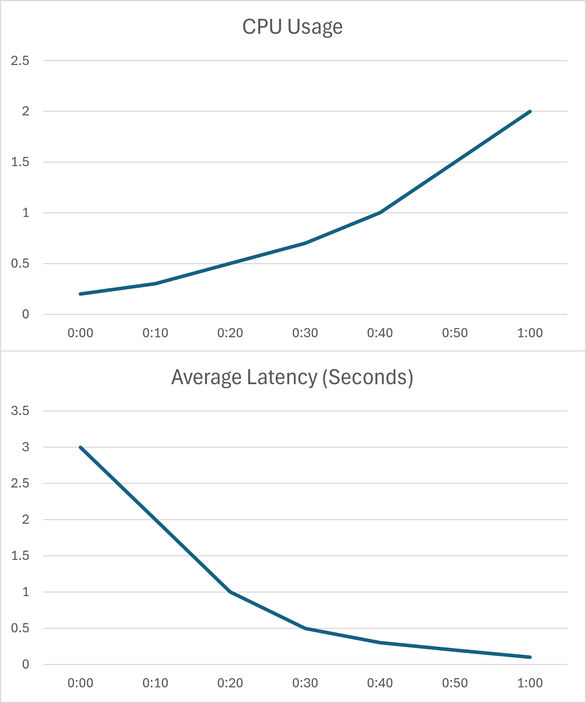

**Monitoring** refers to tracking subsidiary information of a system,
such as memory usage, average latency, application logs, etc.

This is a critical aspect of a system,
especially in terms of scaling and troubleshooting problems.

## Monitoring Model

It's recommended to build a centralized monitoring service.
This gives a global view of the system state,
making it more convenient and easier to manage and diagnose monitored metrics.

Basically, there are 2 paradigms of monitoring:

1. **Push Model**: This model requires installing an agent on tracked services,
which then uses that agent to send data directly to the monitoring service.
Since each piece of data is immediately transferred, this model is **reliable**.

```d2
m: Monitoring Service {
    class: monitor
}
s1: Service 1 {
    class: server
}
s2: Service 2 {
    class: server
}
s1 -> m: Push data
s2 -> m: Push data
```

2. **Pull model**: In this model, services must expose an interface to report their state.
The monitoring service **periodically** pull data from that interface.

```d2
m: Monitoring Service {
    class: server
}
s1: Service 1 {
    class: server
}
s2: Service 2 {
    class: server
}
s1 -> m: Pull data {
  style.animated: true
}
s2 -> m: Pull data {
  style.animated: true
}
```

The pull model can result in data loss (e.g., if a service crashes before being pulled),
but it helps decouple the service from the monitor.

### Metric

A metric is a **quantitative measurement** that provides insights of a system.
- Hardware: CPU usage, memory consumption, disk space,...
- Network: network throughput, bandwidth usage...
- ...

Metrics are typically collected with the pull model because metric loss is acceptable.
The system state is formed from a series of metrics,
and some dropped values may not largely affect the overall result.
For example, a machine reports its CPU usage every 5s `[50%, 60%, 80%, 50%, ...]`.
Using any single element (e.g. `80%`) is unreliable,
we should instead depend on an aggregrated value,
e.g., the average CPU usage of the last minute.

Metrics can be basically categorized into:

- **Application Metric**: dynamic application-level metrics (number of HTTP requests, number of concurrent connections, average latency...).
- **Hardware Metric**: physical hardware metrics (CPU, RAM, network, disk...).

### Logging

Unlike metrics,
logs are generated by intended actions (e.g., business transactions, system administrations),
they should be reliably stored for further diagnosis and troubleshoots.
Thus, we use the push model in this case,
services must immediately send logs to the **Logging Service**.

```d2
l: Logging Service {
  class: monitor
}
s1: Service 1 {
  class: server
}
s2: Service 2 {
  class: server
}
s1 -> l: Log
s2 -> l: Log
```

### Distributed Tracing

**Distributed Tracing** is a technique used to monitor distributed systems.
In short, it provides insights into how requests **flow** through various services

Let's see some terminologies
- **Trace**: a trace captures the journey of a transaction through the system.
- **Span**: a span is a single operation (not a visited service) within a trace.

For example, we have an operation going through some services:

- Services must use the same **trace id** for grouping the **trace**.
- For each step, the service must report the tracing service about the span with increased **span number**.

```d2
grid-columns: 1
t: {
  class: none
  t: Tracing Service {
    class: server
  }
}
s: Trace {
  grid-rows: 1
  s1: Service 1 {
    style.width: 200
    t: |||yaml
    trace id: 123
    span number: 1
    execution time: 0.1s
    |||
  }
  s2: Service 2 {
    style.width: 600
    t: |||yaml
    trace id: 123
    span number: 2
    execution time: 2s
    |||
  }
  s3: Service 3 {
    style.width: 200
    t: |||yaml
    trace id: 123
    span number: 3
    execution time: 0.2s
    |||
  }
}
s.s1 -> t.t
s.s2 -> t.t
s.s3 -> t.t
```

The final trace will show how long it takes in each service,
pointing out which services potentially the system's bottlenecks (long-running spans).
Based on them, we may scale or even re-design the system.

## Automatic Scaling

We've basically discussed scaling models in the [Microservice]() topic,
now we are going to make them clearer.

It's extremelly exhausting to scale big systems manually ,
sometimes, they can grow to hundreds of machines and thousands of containers.
This section gives you a mindset of automatic scaling with [Containerization](,
ensuring the system is rapidly adapted and cost-effective.

### Vertical Scaling

Traditionally, we scale a server by upgrading its size.
If it lacks resources (CPU, RAM...), we provide it with more to ensure the performance.

```d2
server1: Server {
  class: server
  width: 100
  height: 100
}
server2: Scaled Server {
  class: process
  width: 300
  height: 300
}
server1 -> server2
```

This is the philosophy of [Vertical Scaling](),
we think about hardware first.
When the system needs scaling, we treat hardware as the unit,
e.g., *increase 1 CPU*, *decrease 10GB memory*.

### Horizontal Scaling

[Containerization]() is a modern approach for managing a distributed system.
A container runs an application with some processes, its resources are isolated and **limited**.
Now, we treat container (or application) as the scaling unit, e.g., *run 5 containers*, *remove 3 containers*.

If a container runs out of resource, we will create a new one instead of vertically upgrading it.
This is called [Horizontal Scaling]({{< ref "microservice#horizontal-scaling"),
recommending focusing on **the application** first rather than hardware.

We actually abstract hardware by embedding it into containers.
In other words, we need to specifically control containers' resources,
e.g., we provision `1GB memory` for a container, then running `5 containers` means provisioning `5GB memory`.
This leads to a challenging question: *how much resource does a container need?*

- **Over-provisioned**: If we build an excessively large container,
the container may not fully utilize the allocated resources, causing wasted capacity.
For example, `Container 1` only consumes 50% of its resources, while `Container 2` is in need.

```d2
m: Server {
    grid-gap: 0
    grid-rows: 1
    a1: Container 1 {
        grid-gap: 0
        grid-rows: 1
        e: "Usage (50%)" {
          width: 150
          style.fill: ${colors.b}
        }
        e: "Unused resources" {
          width: 150
          style.fill-pattern: lines
        }
    }
    a2: Container 2 {
        grid-gap: 0
        e: "Usage (100%)" {
          width: 100
          style.fill: ${colors.b}
        }
    }
}
```

- **Under-provisioned**: small containers will result in degraded performance due to lack of resources.
Additionally, it will result in more containers for the service, consuming more system resources.

In a perfect context, we expect that containers meet their demand and make use of all system resources:

### Load Testing

Determining a **right-size** container is a tough nut to crack, requiring much expertise and effort.
**Load Testing** is a common technique to cope with this task.

In brief, we need to simulate the production environment
by mocking user requests **as if** we've released the application with the anticipated traffic.
In this process, we need to capture how the application consumes hardware and its performance over time.
The final result should show correlations between **Hardware Metrics** and **Application Metrics**.

For example,
a chart showing the referrence average latency and the actual `CPU` usage.



This result help us ensure the application's performce.
Combined with the application's requirements (such as [Service Level Agreement — SLA](https://en.wikipedia.org/wiki/Service-level_agreement)),
e.g., *the application is required that its a may not go under 1 second*,
we can relatively define the **safe range** for the CPU.

### Scaling Stategies

After configuring a container,
now we will see how to manage it with many instances.

#### Aggregated Scaling

It is challenging to scale based on the individual usage of each instance.
Instead, we would use a global view showing the aggregated usage of all instances.

```d2
grid-columns: 1
g: Global View {
    grid-gap: 0
    grid-columns: 2
    e: "Unused (35%)" {
        width: 100
        style.fill-pattern: lines
    }
    a: "Usage (65%)" {
        width: 300
        style.fill: ${colors.b}
    }
}
i: Instances {
    m1: Instance 1 {
        grid-gap: 0
        grid-columns: 1
        e: "Unused (30%)" {
            height: 100
            style.fill-pattern: lines
        }
        a: "Usage (70%)" {
            height: 300
            style.fill: ${colors.b}
        }
    }
    m2: Instance 2 {
        grid-gap: 0
        grid-columns: 1
        e: "Unused (40%)" {
            height: 150
            style.fill-pattern: lines
        }
        a: "Usage (60%)" {
            height: 250
            style.fill: ${colors.b}
        }
    }
}
i.m1 -> g
i.m2 -> g
```

**Aggregated Scaling** recommends to define an expected and let the aggregation usages revolve around that.
E.g., we want the average CPU usage of containers is around `60% - 70%`
- The application scales out (creating containers) if its usage > `70%`, ensuring availability and performance.
- The application scales in (removing containers) if its usage < `60%`, saving resources.

The threshold is varied, usually around `60% - 80%`
- A stable application may need a small extra space.
- An unstable application frequently dealing with traffic bursts may need bigger paddings.

**Aggregated Scaling** is an adaptive strategy,
we scale the system due to what we need.
The primary problem is our system is weak against sudden bursts,
because provisioning hardware and setting up containers are slow.

#### Scheduled Scaling

Another scaling strategy is **Scheduled Scaling**.
In brief, you scale a system based on predefined or predictable traffic patterns.

For example,
we observe that the system experiences much higher traffic at `7pm – 10pm`.
From this piece of knowledge, we prepare the system in advance to ensure seamless experiences.
This method is useful for specific use cases: e-commercial platforms on sales promotions, travel agencies on holidays...

But it is costly,
as we frequently provision more resources than what the system could chew.

Hence, combining both of them is a smart choice.
We can scale the system with [Aggregated Scaling](#aggregated-scaling) normally,
and leverage [Scheduled Scaling](#scheduled-scaling) on occasions.
