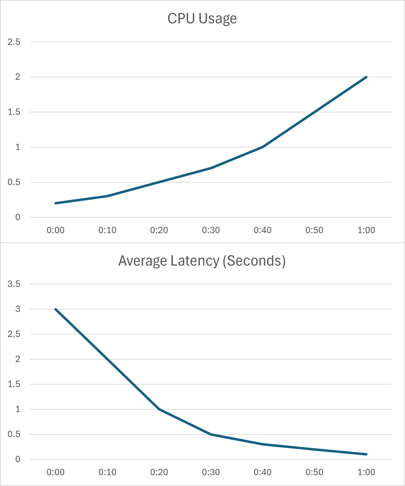
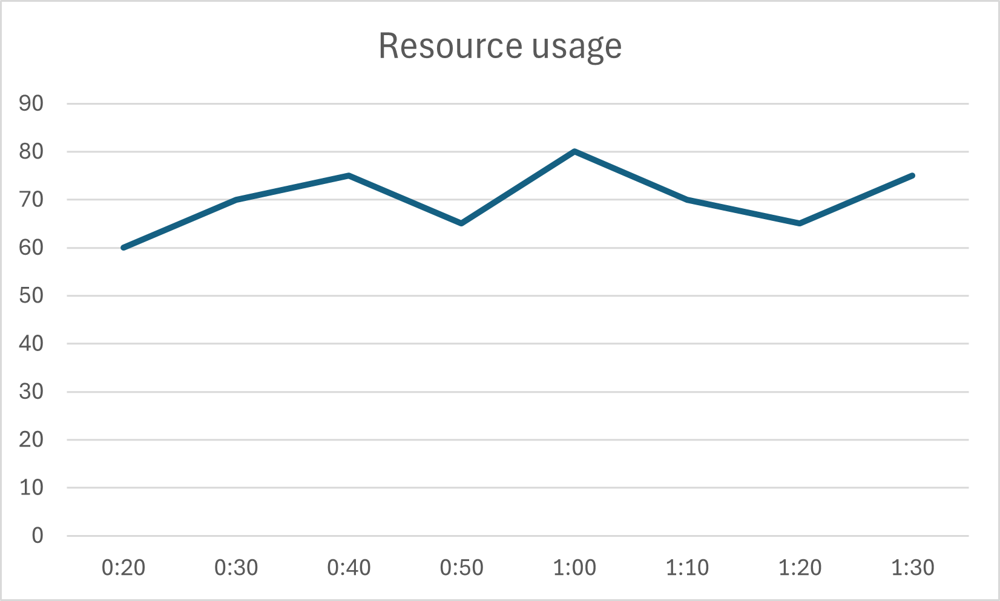

Discussions regarding scaling models have been touched upon previously
in the [Microservice]() topic.

This section aims to further clarify these concepts.
Manually scaling large systems,
which can sometimes encompass hundreds of machines and thousands of containers,
is an extremely demanding task.
This section introduces a mindset for automatic scaling,
leveraging [Containerization]() to ensure that the system adapts rapidly to changing demands while remaining cost-effective.

## Vertical Scaling

Traditionally, scaling a server involves upgrading its physical or virtual hardware.
If a server lacks resources such as CPU or RAM,
more resources are allocated to it to maintain performance.

```d2
direction: right
server1: Server {
  class: server
  width: 100
  height: 100
}
server2: Scaled Server {
  class: server
  width: 200
  height: 200
}
server1 -> server2: Add 4 CPU cores
```

This philosophy is known as **Vertical Scaling**,
where the primary focus is on enhancing the **hardware** capabilities.
When the system requires scaling,
hardware components are treated as the units of increment,
for example, *adding 4 cores* or *decreasing 1GB memory*.

## Horizontal Scaling

[Containerization]() offers a modern approach to managing distributed systems.
A container runs an application along with its processes,
and its resources are isolated and **limited**.

In this paradigm, the container (or the application instance) becomes the unit of scaling.
For instance, scaling might involve *running 5 additional containers* or *removing 3 existing containers*.
If a container runs out of resources, a new one is created instead of vertically upgrading the existing one.
This is known as **Horizontal Scaling**,
which prioritizes focusing on **application** rather than the underlying hardware.

This means we need to specifically control the resources allocated to containers.
For example, if we provision `1GB of memory` for a container,
running `5 containers` would mean provisioning a total of `5GB of memory`.
This leads to a critical question: *how much resource does an individual container actually need?*

- **Over-provisioned**: If a container is allocated excessively large resources,
it may not fully utilize them, leading to **wasted capacity**.
For example, `Container 1` might only consume `30%` of its allocated resources,
while `Container 2` is resource-constrained.

```d2
m: Server {
    grid-gap: 0
    grid-rows: 1
    a1: Container 1 {
        grid-gap: 0
        grid-columns: 1
        u1: "Usage (30%)" {
          width: 150
          height: 60
          style.fill: ${colors.i1}
        }
        u2: "Unused (70%)" {
          width: 150
          height: 140
          style.fill-pattern: lines
        }
    }
    a2: Container 2 {
        grid-gap: 0
        grid-columns: 1
        e: "Usage (90%)" {
          width: 150
          height: 180
          style.fill: ${colors.i1}
        }
    }
}
```

- **Under-provisioned**: Conversely,
containers allocated insufficient resources will experience diminished computational power
and suffer from **degraded performance**.

In an ideal scenario,
containers should have just enough resources to meet their demand
and collectively make optimal use of all available system resources.

## Load Testing

Determining the **right-size** for a container is a challenging task that requires significant expertise and effort.

**Load Testing** is a common technique employed to address this.
In essence, load testing involves simulating the production environment by
generating user requests that mimic the anticipated traffic levels as if the application were already live.
Throughout this process,
it's crucial to capture how the application consumes hardware resources and how its performance metrics change over time.
The final results should demonstrate the correlations between **Hardware Metrics** (e.g., CPU usage, memory consumption) and **Application Metrics** (e.g., response time, throughput).

For example, a chart might illustrate the relationship between average latency and actual CPU usage.



Combined with the application's specific requirements (such as those defined in a [Service Level Agreement (SLA)](https://en.wikipedia.org/wiki/Service-level_agreement)),
this data helps ensure the application's performance targets can be met.
For instance, *the application's average response time must not exceed 1 second*,
a safe operational range for metrics like CPU usage can be relatively defined.

## Scaling Strategies

Once a container's resource profile is configured,
the next step is to manage multiple instances of it effectively.

### Aggregate Scaling

Scaling based on the individual resource usage of each instance can be complex.
Instead, a more common approach is to use a global view that shows the aggregated usage across all instances.

```d2
grid-columns: 1
g: Global View {
    grid-gap: 0
    grid-columns: 2
    e: "Unused (35%)" {
        width: 100
        style.fill-pattern: lines
    }
    a: "Usage (65%)" {
        width: 300
        style.fill: ${colors.i1}
    }
}
i: Instances {
    m1: Instance 1 {
        grid-gap: 0
        grid-columns: 1
        a: "Usage (70%)" {
            height: 300
            style.fill: ${colors.i1}
        }
        e: "Unused (30%)" {
            height: 100
            style.fill-pattern: lines
        }
    }
    m2: Instance 2 {
        grid-gap: 0
        grid-columns: 1
        a: "Usage (60%)" {
            height: 250
            style.fill: ${colors.i1}
        }
        e: "Unused (40%)" {
            height: 150
            style.fill-pattern: lines
        }
    }
}
i.m1 -> g
i.m2 -> g
```

**Aggregate Scaling** recommends defining an expected target range for resource utilization and allowing the aggregated usage to fluctuate around that range.
For example, the desired average CPU usage for containers might be set between `60% - 70%`.

- The application **scales out** (creates more containers) if its aggregated usage exceeds `70%`, ensuring availability and performance.
- The application **scales in** (removes containers) if its aggregated usage drops below `60%`, thereby saving resources.

The specific threshold varies, typically falling between `60% - 80%`:

- A stable application with predictable load might require a smaller buffer (extra capacity).
- An unstable application that frequently deals with traffic bursts may need larger paddings to absorb sudden increases in demand.

An effective scaling strategy, when graphed over time, often resembles a sawtooth pattern,
characterized by sharp increases in resource allocation to meet rising demand, followed by decreases as demand subsides.



**Aggregate Scaling** is an adaptive strategy,
as the system scales in response to actual observed needs.
The primary challenge with this approach is its potential vulnerability to sudden,
sharp bursts in traffic, because provisioning new hardware and initializing containers can be time-consuming processes.

### Scheduled Scaling

Another scaling strategy is **Scheduled Scaling**.
In this approach, the system is scaled based on predefined or predictable traffic patterns.

For instance,
if observation shows that the system consistently experiences significantly higher traffic between `7 PM – 10 PM`,
the system can be prepared in advance by proactively scaling out resources before this period to ensure a seamless user experience.
This method is particularly useful for specific use cases, such as e-commerce platforms during sales promotions or travel agencies during holiday seasons.

However, scheduled scaling can be costly,
as it often involves provisioning more resources than
what the system might strictly require at all times within the scheduled window.

In practice, combining both aggregated and scheduled scaling is often a prudent choice.
The system can operate under **Aggregate Scaling** for normal,
adaptive adjustments, while leveraging **Scheduled Scaling** for predictable peak load occasions.
