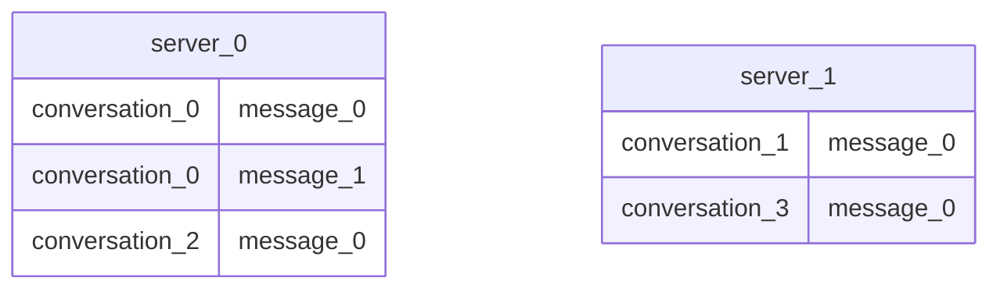
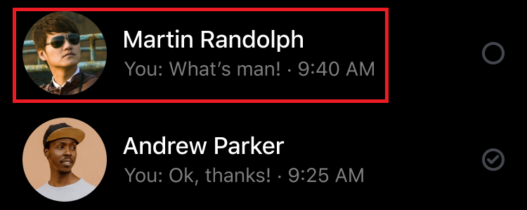

This document outlines the design and implementation of a chat application with one-to-one and group messaging capabilities.

## Requirements

### Functional Requirements

**Conversations**:

- Users can engage in direct (one-to-one) chats.
- Users can participate in group conversations. Groups can have a maximum of 10,000 members.

**Messaging**:

- All messages are text-based, with a limit of 4096 characters.
- Messages must be sorted in **chronological order**.
- Messages are **immutable** and cannot be changed after being sent.

### Non-functional Requirements

- **Real-time Delivery**: Messages must be delivered in real-time with low latency.
- **Reliability**: Online users must not miss any messages from their conversations.
- **Availability**: The application will primarily serve users in **Southeast Asia** and the **United States**.

## System Design Overview

When a user logs into the application, the following interactions occur:

- **Conversation Service**: The user's device fetches historical conversations and messages.
- **Chat Service**: The user establishes a persistent connection to a realtime server for sending and receiving new messages.

```d2
grid-rows: 1
horizontal-gap: 150
user: User {
    class: client
}
s: System {
    grid-columns: 1
    m: Conversation Service {
        class: server
    }
    c: Chat Service {
        class: server
    }
}
user <- s.m: loads messages
user <-> s.c: realtime messaging {
    style.animated: true
}
```

We will now examine each component in detail, starting with the data layer,
which is the foundation of the system's design.

## Conversation Service

The **Conversation Service** is responsible for storing and retrieving all message history.
This is particularly important for users who are coming online or switching devices and need to load a large volume of historical messages.

### Message Store

Since messages must be rendered in chronological order,
a database that natively supports sorted data is ideal, as it eliminates the need for secondary indexes.

- **Relational databases**, such as MySQL, are effective as they can physically arrange data in sorted order.
- **NoSQL Column-family stores** (e.g., Cassandra, Amazon DynamoDB) are also strong candidates.
They are often implemented using a **Log-structured Merge Tree (LSMT)**, a data structure that is highly efficient for handling sorted data.

> Refer to this post to learn more about [NoSQL Stores]().

For this design, we will proceed with a NoSQL approach for several reasons:

- The primary access pattern involves loading messages from a single conversation at a time.
This simple query pattern is well-suited for a distributed NoSQL database.
- The schema flexibility of NoSQL makes it easier to support new message formats (e.g., images, videos) in the future.

The basic schema for our messages will be:

- A `conversation_id` uniquely identifies each one-to-one or group chat.
- Messages within a conversation have incrementally increasing `message_number`s.
- A message is therefore uniquely identified by the composite key `(conversation_id, message_number)`.

```d2
MESSAGE {
    shape: sql_table
    conversation_id: UUID {constraint: Partition Key}
    message_number: INT {constraint: Sort Key}
    sender_id: UUID
    content: VARCHAR
    created_at: TIMESTAMP
}
```

This schema allows us to distribute messages effectively:

- The **partition key** is `conversation_id`, which co-locates all messages from the same conversation on a single partition.
- The **sort key** is `message_number`, which ensures messages are natively sorted within the partition.



To further optimize performance, client devices should **locally cache** messages.
This allows the client to fetch only the messages that are newer than what it already has stored.

```sql
FROM MESSAGE
WHERE conversation_id = @conversation_id AND message_number > @last_fetched_number
```

### Conversation Store

A user can be a participant in many conversations.
To manage this relationship, we can use a relational database with the following schema:

```d2
direction: right
CONVERSATION {
    shape: sql_table
    conversation_id: UUID {constraint: Primary Key}
    updated_at: TIMESTAMP
}

PARTICIPATION {
    shape: sql_table
    conversation_id: UUID {constraint: Primary Key}
    user_id: UUID {constraint: Primary Key}
}

PARTICIPATION -> CONVERSATION: belongs to
```

To avoid loading all of a user's conversations at once, we will implement pagination.
By updating the `updated_at` timestamp of a conversation whenever a new message is sent,
we can paginate a user's conversations based on this field.
For users scrolling through their conversation list, [Keyset Pagination]() is an effective strategy.

Combined with local caching,
the client only needs to fetch conversations that have been updated since the last sync.

```sql
FROM CONVERSATION c
INNER JOIN PARTICIPATION p ON p.conversation_id = c.conversation_id 
WHERE p.user_id = @user_id
    -- Keyed field for pagination
    AND c.updated_at > @last_fetched_time
ORDER BY c.updated_at DESC LIMIT @page_size
```

#### NoSQL Consideration

One might consider using a distributed NoSQL store for conversation metadata by partitioning the `PARTICIPATION` records by `user_id`.
By denormalizing (replicating) the `updated_at` field from the `CONVERSATION` table into the `PARTICIPATION` table,
fetching a user's conversations would be a highly efficient single-node operation.

```d2
direction: right
CONVERSATION {
    shape: sql_table
    conversation_id: UUID {constraint: Primary Key}
    updated_at: TIMESTAMP
}
PARTICIPATION {
    shape: sql_table
    conversation_id: UUID {constraint: Primary Key}
    user_id: UUID {constraint: Primary Key}
    updated_at: TIMESTAMP
}
CONVERSATION.updated_at -> PARTICIPATION.updated_at: synced {
    style.animated: true
}
```

However, this design becomes problematic for group chats with many members.
For example, in a group with 1,000 participants, every new message would trigger a write amplification of 1,000 updates to synchronize the `updated_at` timestamp across all participation records.
The cost of this write-heavy operation outweighs the read benefits.
Therefore, we will stick with a relational database for storing conversation metadata.

#### Self-contained Conversations

So far, our design uses two separate databases: a **Column-family store** for messages and a **SQL database** for conversation metadata. This leads to a common performance issue known as the **N+1 query problem**.

When a user fetches a page of their conversations, the following happens:

1. One query fetches a page of `conversation_id`s from the conversations store.
2. For each `conversation_id` returned, a separate query must be executed against the messages store to fetch the latest message details (e.g., sender info, content snippet) needed to render the conversation list item.

> 
> Source: [pixsellz.io](https://www.figma.com/community/file/874577850804632750)

To solve this, we will denormalize the data by duplicating the latest message information into the `CONVERSATION` table.
When a new message is sent, we will update both the message store and the corresponding `CONVERSATION` record.

```d2
direction: right
MESSAGE {
    shape: sql_table
    conversation_id: UUID {constraint: Partition Key}
    message_number: INT {constraint: Sort Key}
    sender_id: UUID
    content: VARCHAR
    created_at: TIMESTAMP
}
CONVERSATION {
    shape: sql_table
    conversation_id: UUID {constraint: Primary Key}
    updated_at: TIMESTAMP
    last_message_number: UUID
    last_sender_id: UUID
    last_message_content: VARCHAR
}
MESSAGE -> CONVERSATION: synced {
    style.animated: true
}
```

> Please note that this diagram is for demonstration; these datasets actually exist in **different stores**.

With this enhancement, conversation pages become self-contained, and all the necessary data can be fetched in a single, efficient request, eliminating the problem at the cost of increased complexity to maintain data synchronization.

## Chat Service

This section focuses on the real-time delivery of messages to online users.

### Real-time Cluster

The primary challenge is to transfer messages in real-time.
Among various messaging protocols like **Long Polling**, **Server-Sent Events (SSE)**, and **WebSocket**, we will use the **WebSocket** protocol.
Its support for persistent, **two-way communication** makes it ideal for **immediate message delivery**.

> For more information, refer to this article on [communication protocols]().

A single WebSocket server cannot handle all user connections.
Instead, users will be distributed across a cluster of real-time servers.

```d2
u: Users {
    class: client
}
r: Realtime Cluster {
    s0: server_0 {
        class: server
    }
    s1: server_1 {
        class: server
    }
}
u -> r.s0
u -> r.s1
```

Since users can connect to different servers, we need an effective mechanism to route messages between them.
Two approaches can be considered:

1. **Mapping Store**: A centralized store (e.g., Redis) maps each connected `user_id` to their current `server_id`. When a server needs to send a message to a user, it looks up the target server in this store.

    ```yaml
    servers:
        user_0: server_0
        user_1: server_2
        user_2: server_0
    ```

2. **Hashing Technique**: An implicit routing rule assigns users to servers based on a consistent hash of their `user_id`, such as `target_server = hash(user_id) % number_of_servers`.

    ```d2
    grid-columns: 1
    g1: {
        class: none
        grid-rows: 1
        c1: user_0 {
            class: client
        }
        c2: user_1 {
            class: client
        }
    }
    s: Cluster {
        grid-rows: 1
        s1: server_0 {
            class: server
        }
        s2: server_1 {
            class: server
        }
    }
    g1.c1 -> s.s1: '0 % 2 = 0' {
        class: bold-text
    }
    g1.c2 -> s.s2: '1 % 2 = 1' {
        class: bold-text
    }
    ```

The first approach (mapping store) is more suitable for this use case.
WebSocket connections are long-lived and sticky, meaning a user remains connected to a specific server for their entire session.

The online status of users is unpredictable.
The hashing technique could lead to poor load distribution; for example, if many online users happen to have odd-numbered IDs, `server_1` could become overloaded while `server_0` remains idle.
The mapping store approach adapts dynamically to the actual distribution of online users.

### Fan-out Pattern

The direct server-to-server routing model becomes problematic for group chats.
When a message is sent to a group, the sending server would need to identify and contact every server that has a participant of that group.
This creates a complex and resource-intensive web of communication.

```d2
direction: right
s0: server_0 {
    class: server
}
s1: server_1 {
    class: server
}
s2: server_2 {
    class: server
}
s3: server_3 {
    class: server
}
s0 -> s1
s0 -> s2
s0 -> s3
```

A more scalable and manageable solution is to introduce an intermediate fan-out channel (e.g., a message broker like **RabbitMQ** or a pub/sub service like **Amazon SNS**).
When a server sends a message, it publishes it to this central channel.
The channel is then responsible for fanning out the message to all the relevant destination servers. We can use the destination `server_id`s as [routing keys](https://www.rabbitmq.com/tutorials/amqp-concepts#exchange-topic) to ensure the message is delivered only to the necessary servers.

```d2
direction: right
s0: server_0 {
    class: server
}
c: Fan-out channel {
    class: gw
}
s1: server_1 {
    class: server
}
s2: server_2 {
    class: server
}
s3: server_3 {
    class: server
}
s0 -> c: "routing keys = [1,2,3]" {
    class: bold-text
}
c -> s1
c -> s2
c -> s3
```

#### Identifying Target Servers

The next question is: how does the sending server determine which `server_id`s to use as routing keys?
In other words, how do we find all the servers that have active connections for a given conversation?

A simple way is to maintain a connection table that tracks the server for each active user device.

```d2
USER_CONNECTION {
    shape: sql_table
    user_id: UUID {constraint: Primary Key}
    device_id: UUID {constraint: Primary Key}
    server_id: CHAR
}
PARTICIPATION {
    shape: sql_table
    conversation_id: UUID {constraint: Primary Key}
    user_id: UUID {constraint: Primary Key}
}
```

To find the target servers for a conversation, we can perform a `JOIN` between the `PARTICIPATION` and `USER_CONNECTION` tables on `user_id`.
Because user connection status is highly volatile (users connect and disconnect frequently), the results of this query should not be cached, as the cache would become stale very quickly.

#### Alternative: Actively Tracking Connections

For systems with very large groups and high message frequency, re-querying the database for every message could become a bottleneck. An alternative approach is to actively track the set of target servers for each conversation in a fast in-memory store like Redis.

When a user connects to the Chat Service, the system would:

1. Query all `conversation_id`s for that user from the `PARTICIPATION` table.
2. For each `conversation_id`, add the user's `server_id` to a shared set (e.g., **Redis**)
that tracks the active servers for that conversation. When the user disconnects, the `server_id` would be removed from these sets.

    ```bash
    # Redis syntax for each of the user's conversations
    SADD conversations:{conversation_id}:servers {server_id}
    ```

The major drawback of this approach is the high number of updates required for users who are part of many conversations.
If a user is in hundreds of groups, their connection or disconnection would trigger hundreds of Redis updates.
This can lead to a **thundering herd** problem of updates and creates significant complexity in keeping the cache perfectly synchronized with the actual connection state.

Given the requirement of up to 10,000 members per group, the on-demand querying approach is deemed sufficient and less complex.
Therefore, **we will skip the active tracking solution** in this project to avoid its complexity and potential for error.

## Implementation

This section details the implementation and infrastructure of the chat system within the **AWS** cloud. A key requirement is to serve users in both **Southeast Asia (ap-southeast-1)** and the **United States (us-east-1)**.
To reduce latency and avoid high cross-region data transfer costs, we will deploy the system in a **multi-region setup**, allowing users to connect to the geographically closest infrastructure.

### Database Layer

The database architecture consists of two distinct stores, as previously discussed.

#### Conversation Store {#infra-conversation-store}

The core relational database, which stores conversation metadata and user connection status, has the following schema:

```d2
direction: right
USER_CONNECTION: {
    shape: sql_table
    user_id: UUID {constraint: Primary Key}
    device_id: UUID {constraint: Primary Key}
    server_id: CHAR
}
CONVERSATION {
    shape: sql_table
    conversation_id: UUID {constraint: Primary Key}
    updated_at: TIMESTAMP
    last_message_number: UUID
    last_sender_id: UUID
    last_message_content: VARCHAR
}
PARTICIPATION {
    shape: sql_table
    conversation_id: UUID {constraint: Primary Key}
    user_id: UUID {constraint: Primary Key}
}
CONVERSATION -> PARTICIPATION: belongs to
```

Both **Amazon RDS** and **Amazon Aurora** are suitable for this purpose.
While **Aurora** is more expensive, it offers higher performance, reduced management overhead, and a straightforward solution for multi-region replication via its **Aurora Global Database** feature.
This feature designates a primary region and automatically forwards all write operations from secondary regions to the primary.

```d2
direction: right
p: Primary region {
    class: aws-aurora
}
s: Secondary region {
    class: aws-aurora
}
s -> p: Forward writes {
    style.animated: true
}
```

#### Regional Connections Consideration

A user connecting or disconnecting triggers a write to the `USER_CONNECTION` table. Since users connect and disconnect frequently, this would result in a high volume of cross-region write forwards, incurring significant costs.

An alternative would be to manage the `USER_CONNECTION` table locally within each region.
However, this creates a new problem: how does a server in one region route a message to a server in another region if connection data is not globally available?
The only solution would be to broadcast messages to the other region, hoping a recipient is there.
This is inefficient, wastes bandwidth, and we need to run another database as Aurora Global Database does not support excluding specific tables from replication.
Therefore, **we will not adopt this regional approach** and will accept the cost of replicating connection status globally.

#### Message Store {#infra-message-store}

The message data itself is stored in a column-family table.

```d2
MESSAGE {
    shape: sql_table
    conversation_id: UUID {constraint: Partition Key}
    message_number: INT {constraint: Sort Key}
    sender_id: UUID
    content: VARCHAR
    created_at: TIMESTAMP
}
```

We will use **Amazon DynamoDB**, which natively supports multi-region deployments with its **Global Tables** feature. Unlike Aurora, DynamoDB Global Tables use an **active-active** replication strategy, where writes can occur in any region. Conflicts are resolved using a [last writer wins]() mechanism.

```d2
direction: right
u: us-east-1 {
  t: DynamoDB Table {
    class: aws-dynamodb
  }
}
a: ap-southeast-1 {
  t: DynamoDB Table {
    class: aws-dynamodb
  }
}
u.t <-> a.t: active-active replication {
  style.animated: true
}
```

### Web Service Layer

#### Fan-out Pattern Implementation

The fan-out pattern for real-time message delivery will be implemented using **Amazon SNS (Simple Notification Service)** and **SQS (Simple Queue Service)**. These serverless services reduce management overhead and handle AWS-native workloads like cross-region data transfer efficiently.

For each chat server instance, we will create a dedicated SQS queue. The server will publish messages to a regional SNS topic. SNS will then use message attributes (e.g., `target_server_id`) to route the message to the correct SQS queues.

```d2
direction: right
prod: "Server 0" {class: aws-ec2}
sns: "SNS Topic" {class: aws-sns}
sqs_1: "SQS Queue 1" {class: aws-sqs}
s1: "Server 1" {class: aws-ec2}
sqs_2: "SQS Queue 2" {class: aws-sqs}
s2: "Server 2" {class: aws-ec2}
prod -> sns: produces
sns -> sqs_1: "target = server_1"
sns -> sqs_2: "target = server_2"
sqs_1 -> s1
sqs_2 -> s2
```

Using SQS queues as a buffer between SNS and the consumer servers is crucial for two reasons:

- **Scalability**: SQS provides a backpressure buffer, preventing consumer servers from being overwhelmed by sudden spikes in traffic.
- **Resilience**: If a server becomes temporarily unavailable, messages are held reliably in its queue until the server can process them.

To optimize for multi-region cost, when a server determines that a message has recipients in another region, it will publish that message directly to the **SNS topic in the target region**. This avoids having one message cross the regional boundary multiple times (once for each recipient queue).

```d2
direction: right
ap: "ap-southeast-1" {
  direction: right
  prod: "Server 0 (Producer)" {class: aws-ecs}
  sns: "SNS Regional Topic" {class: aws-sns}
}
us: "us-east-1" {
  direction: right
  sns_r: "SNS Regional Topic" {class: aws-sns}
  sqs_1: "SQS Queue 1" {class: aws-sqs}
  sqs_2: "SQS Queue 2" {class: aws-sqs}
}
ap.prod -> ap.sns
ap.prod -> us.sns_r
us.sns_r -> us.sqs_1
us.sns_r -> us.sqs_2
```

We do not need to enable **SNS/SQS FIFO** options.
Each chat server can track the `message_number` of the last message it delivered for a conversation.
If an out-of-order message arrives, the server can either fetch the missing messages from the messages store (if there's a gap)
or simply discard the message (if it's older than the last one sent).

#### Multi-region Deployment

We will build two distinct services:

- **Conversation Service**: A stateless **HTTP** API that serves data from the relational store.
We will use a **Round-robin** load balancing strategy, as requests are short-lived.
- **Chat Service**: A stateful service managing long-lived WebSocket connections. We will use a **Least Connections** load balancing strategy to distribute users evenly across available servers.

> Refer to this article for more information about [Load Balancing]() algorithms.

The infrastructure will be built using the following AWS services:

- **Amazon ECS (Elastic Container Service)** for running our containerized services.
- **Application Load Balancer (ALB)** configured with listener rules for both Round-robin (HTTP) and Least Connections (WebSocket) traffic.
- **Amazon Route 53** with **Latency-based routing** to direct users to the nearest regional deployment.
- **VPC Endpoints** (**Gateway** for DynamoDB; **Interface** for SQS/SNS) to ensure secure, private communication between our services and other AWS services.

The final architecture for a single region is as follows:

```d2
direction: right
r: Route53 {
  class: aws-route53
}
u: us-east-1 {
    grid-columns: 1
    v: VPC {
        direction: right
        lb: "Load Balancer" {class: aws-elb}
        api: "Conversation Service" {class: aws-ecs}
        chat: "Chat Service" {class: aws-ecs}
        lb -> api: Round-robin
        lb -> chat: Least-connections
        a: Conversation Store {
            class: aws-aurora
        }
    }
    a: AWS Managed {
        grid-rows: 1
        horizontal-gap: 150
        t: Message Store {
            class: aws-dynamodb
        }
        sqs: SQS Queues {
            class: aws-sqs
        }
        sns: Regional SNS Topic {
            class: aws-sns
        }
        sns -> sqs: fan-out
    }
    v.api <-> v.a: manipulates
    v.chat <-> a.t: manipulates
    v.chat <- a.sqs: pulls
    v.chat -> a.sns: publishes
}
a: ap-southeast-1 {
    class: aws-vpc
}
r -> u.v
r -> a
```

While this architecture may seem complex, it is a realistic representation of what is required to build a scalable, available, and performant chat application in a multi-region environment.
The trade-off for this complexity is a robust system that avoids the bottlenecks and single points of failure inherent in simpler, direct communication models.
