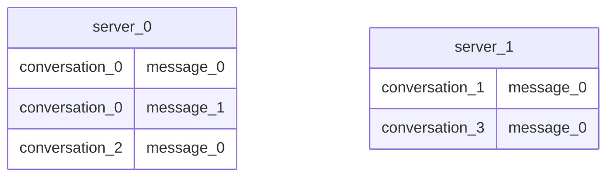
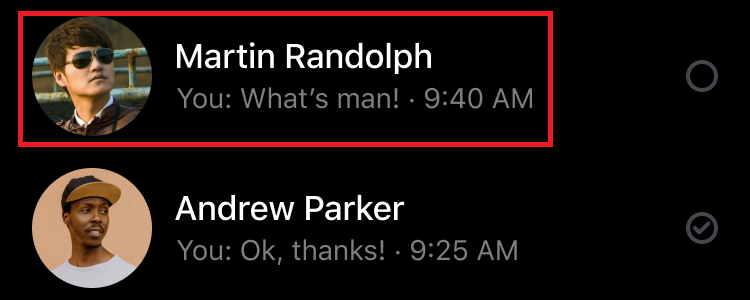

This document outlines the design and implementation of a chat application with one-to-one and group messaging capabilities.

## Requirements

### Functional Requirements

**Conversations**:

- Users can engage in direct (one-to-one) chats.
- Users can participate in group conversations.

**Messaging**:

- All messages are text-based, with a limit of 4096 characters.
- Messages must be sorted in **chronological order**.
- Messages are **immutable** and cannot be changed after being sent.

### Non-functional Requirements

- **Real-time Delivery**: Messages must be delivered in real time with low latency.
- **Reliability**: Online users must not miss any messages from their conversations.
- **Availability**: The application will primarily serve users in **Southeast Asia** and the **United States**.

## System Design Overview

When a user logs into the application, the following interactions occur:

- **Conversation Service**: The user's device fetches historical conversations and messages.
- **Chat Service**: The user's device establishes a persistent connection to a real-time server to send and receive new messages.

```d2
grid-rows: 1
horizontal-gap: 150
user: User {
    class: client
}
s: System {
    grid-columns: 1
    m: Conversation Service {
        class: server
    }
    c: Chat Service {
        class: server
    }
}
user <- s.m: loads messages
user <-> s.c: realtime messaging {
    style.animated: true
}
```

We will now examine each component in detail, starting with the data layer,
which is the foundation of the system's design.

## Conversation Service

The **Conversation Service** is responsible for storing and retrieving all message history.
This is particularly important for users who are coming online or switching devices and need to load a large volume of historical messages.

### Message Store

Since messages must be rendered in chronological order,
a database that natively supports sorted data is ideal, as it eliminates the need for secondary indexes.

- **Relational databases**, such as MySQL, are effective because they can physically arrange data in sorted order.
- **NoSQL column-family stores** (e.g., Cassandra, Amazon DynamoDB) are also strong candidates.
They are often implemented using a **Log-structured Merge Tree (LSMT)**, a data structure that is highly efficient for handling sorted data.

> Refer to this post to learn more about [NoSQL Stores]().

For this design, we will proceed with a NoSQL approach for several reasons:

- The primary access pattern involves loading messages from a single conversation at a time.
This simple query pattern is well-suited for a distributed NoSQL database.
- The schema flexibility of NoSQL makes it easier to support new message formats (e.g., images, videos) in the future.

The basic schema for our messages will be:

- A `conversation_id` uniquely identifies each one-to-one or group chat.
- Messages within a conversation have progressively increasing `message_number` values, such as UUIDv7 identifiers.
- A message is therefore uniquely identified by the composite key `(conversation_id, message_number)`.

```d2
MESSAGE {
    shape: sql_table
    conversation_id: UUID {constraint: Partition Key}
    message_number: UUID {constraint: Sort Key}
    sender_id: UUID
    content: VARCHAR
    created_at: TIMESTAMP
}
```

This schema allows us to distribute messages effectively:

- The **partition key** is `conversation_id`, which co-locates all messages from the same conversation on a single partition.
- The **sort key** is `message_number`, which ensures messages are natively sorted within the partition.


```mermaid
erDiagram
    server_0 {
        conversation_0 message_0
        conversation_0 message_1
        conversation_2 message_0
    }
    server_1 {
        conversation_1 message_0
        conversation_3 message_0
    }
```

To further optimize performance, client devices should **locally cache** messages.
This allows the client to fetch only the messages that are newer than what it already has stored.

```sql
FROM MESSAGE
WHERE conversation_id = @conversation_id AND message_number > @last_fetched_number
```

### Conversation Store

A user can be a participant in many conversations.
To manage this relationship, we can use a relational database with the following schema:

```d2
direction: right
CONVERSATION {
    shape: sql_table
    conversation_id: UUID {constraint: Primary Key}
    updated_at: TIMESTAMP
}

PARTICIPATION {
    shape: sql_table
    conversation_id: UUID {constraint: Primary Key}
    user_id: UUID {constraint: Primary Key}
}

PARTICIPATION -> CONVERSATION: belongs to
```

To avoid loading all of a user's conversations at once, we will implement pagination.
By updating the `updated_at` timestamp of a conversation whenever a new message is sent,
we can paginate a user's conversations based on this field.
For users scrolling through their conversation list, [Keyset Pagination]() is an effective strategy.

Combined with local caching,
the client only needs to fetch conversations that have been updated since the last sync.

```sql
FROM CONVERSATION c
INNER JOIN PARTICIPATION p ON p.conversation_id = c.conversation_id 
WHERE p.user_id = @user_id
    -- Keyed field for pagination
    AND c.updated_at > @last_fetched_time
ORDER BY c.updated_at DESC LIMIT @page_size
```

#### NoSQL Consideration

One might consider using a distributed NoSQL store for conversation metadata by partitioning the `PARTICIPATION` records by `user_id`.
By denormalizing (replicating) the `updated_at` field from the `CONVERSATION` table into the `PARTICIPATION` table,
fetching a user's conversations would be a highly efficient single-node operation.

```d2
grid-rows: 1
CONVERSATION {
    shape: sql_table
    conversation_id: UUID {constraint: Primary Key}
    updated_at: TIMESTAMP
}
PARTICIPATION {
    shape: sql_table
    conversation_id: UUID {constraint: Primary Key}
    user_id: UUID {constraint: Primary Key}
    updated_at: TIMESTAMP
}
CONVERSATION.updated_at -> PARTICIPATION.updated_at: synced {
    style.animated: true
}
```

However, this design becomes problematic for group chats with many members.
For example, in a group with 1,000 participants, every new message would trigger a write amplification of 1,000 updates to synchronize the `updated_at` timestamp across all participation records.
The cost of this write-heavy operation outweighs the read benefits.
Therefore, we will stick with a relational database for storing conversation metadata.

#### Self-contained Conversations

So far, our design uses two separate databases: a **column-family store** for messages and a **SQL database** for conversation metadata. This leads to a common performance issue known as the **N+1 query problem**.

When a user fetches a page of their conversations, the following happens:

1. One query fetches a page of `conversation_id` values from the conversation store.
2. For each `conversation_id` returned, a separate query must be executed against the message store to fetch the latest message details (e.g., sender information and a content snippet) needed to render the conversation list item.

> 
> Source: [pixsellz.io](https://www.figma.com/community/file/874577850804632750)

To solve this, we will denormalize the data by duplicating the latest message information into the `CONVERSATION` table.
When a new message is sent, we will update both the message store and the corresponding `CONVERSATION` record.

```d2
grid-rows: 1
MESSAGE {
    shape: sql_table
    conversation_id: UUID {constraint: Partition Key}
    message_number: UUID {constraint: Sort Key}
    sender_id: UUID
    content: VARCHAR
    created_at: TIMESTAMP
}
CONVERSATION {
    shape: sql_table
    conversation_id: UUID {constraint: Primary Key}
    updated_at: TIMESTAMP
    last_message_number: UUID
    last_sender_id: UUID
    last_message_content: VARCHAR
}
MESSAGE -> CONVERSATION: synced {
    style.animated: true
}
```

> This diagram is illustrative; these datasets reside in **different stores**.

With this enhancement, conversation pages become self-contained, and all the necessary data can be fetched in a single, efficient request, eliminating the problem at the cost of increased complexity to maintain data synchronization.

## Chat Service

This section focuses on the real-time delivery of messages to online users.

### Real-time Cluster

The primary challenge is to transfer messages in real time.
Among communication mechanisms such as **Long Polling**, **Server-Sent Events (SSE)**, and **WebSocket**, we will use the **WebSocket** protocol.
Its support for persistent, **two-way communication** makes it ideal for **immediate message delivery**.

> For more information, refer to this article on [communication protocols]().

A single WebSocket server cannot handle all user connections.
Instead, users will be distributed across a cluster of real-time servers.

```d2
u: Users {
    class: client
}
r: Realtime Cluster {
    s0: server_0 {
        class: server
    }
    s1: server_1 {
        class: server
    }
}
u -> r.s0
u -> r.s1
```

Since users can connect to different servers, we need an effective mechanism to route messages between them.
Two approaches can be considered:

1. **Mapping Store**: A centralized store (e.g., Redis) maps each connected `user_id` to their current `server_id`. When a server needs to send a message to a user, it looks up the target server in this store.

    ```yaml
    servers:
        user_0: server_0
        user_1: server_2
        user_2: server_0
    ```

2. **Hashing Technique**: An implicit routing rule assigns users to servers based on a consistent hash of their `user_id`, such as `target_server = hash(user_id) % number_of_servers`.

    ```d2
    grid-columns: 1
    g1: {
        class: none
        grid-rows: 1
        c1: user_0 {
            class: client
        }
        c2: user_1 {
            class: client
        }
    }
    s: Cluster {
        grid-rows: 1
        s1: server_0 {
            class: server
        }
        s2: server_1 {
            class: server
        }
    }
    g1.c1 -> s.s1: '0 % 2 = 0' {
        class: bold-text
    }
    g1.c2 -> s.s2: '1 % 2 = 1' {
        class: bold-text
    }
    ```

The first approach (mapping store) is more suitable for this use case.
WebSocket connections are long-lived and sticky, meaning a user remains connected to a specific server for their entire session.

The online status of users is unpredictable.
The hashing technique could lead to poor load distribution; for example, if many online users happen to have odd-numbered IDs, `server_1` could become overloaded while `server_0` remains idle.
The mapping store approach adapts dynamically to the actual distribution of online users.

### Fan-out Pattern

The direct server-to-server routing model becomes problematic for group chats.
When a message is sent to a group, the sending server would need to identify and contact every server that has a participant of that group.
This creates a complex and resource-intensive web of communication.

```d2
direction: right
s0: server_0 {
    class: server
}
s1: server_1 {
    class: server
}
s2: server_2 {
    class: server
}
s3: server_3 {
    class: server
}
s0 -> s1
s0 -> s2
s0 -> s3
```

A more scalable and manageable solution is to introduce an intermediate fan-out channel,
e.g., **Redis Pub/Sub**.
When a server sends a message, it publishes it to this central channel.
The channel is then responsible for fanning out the message to all relevant destination servers. We can use the destination `server_id` values as [channel names](https://redis.io/docs/latest/commands/pubsub-channels/) to ensure the message is delivered only to the necessary servers.

```d2
direction: right
s0: server_0 {
    class: server
}
c: Fan-out channel {
    class: gw
}
s1: server_1 {
    class: server
}
s2: server_2 {
    class: server
}
s3: server_3 {
    class: server
}
s0 -> c: "channel = [1,2,3]" {
    class: bold-text
}
c -> s1
c -> s2
c -> s3
```

#### Identifying Target Servers

The next question is: *how does the sending server determine which `server_id`s to use as routing keys?*
In other words, how do we find all the servers that have active connections for a given conversation?

A simple way is to maintain a connection table that tracks the server for each active user device.

```d2
grid-rows: 1
USER_CONNECTION {
    shape: sql_table
    user_id: UUID {constraint: Primary Key}
    device_id: UUID {constraint: Primary Key}
    server_id: CHAR
}
PARTICIPATION {
    shape: sql_table
    conversation_id: UUID {constraint: Primary Key}
    user_id: UUID {constraint: Primary Key}
}
```

To find the target servers for a conversation, we can perform a `JOIN` between the `PARTICIPATION` and `USER_CONNECTION` tables on `user_id`.

#### Active Tracking

For systems with very large groups and high message frequency, re-querying the database for every message could become a bottleneck. An alternative approach is to actively track the set of target servers for each conversation in a fast in-memory store like **Redis**.

When a user connects to the Chat Service, the system would:

1. Query all `conversation_id` values for that user from the `PARTICIPATION` table.
2. For each `conversation_id`, add the user's `server_id` to a shared set
that tracks the active servers for that conversation. When the user disconnects, the `server_id` would be removed from these sets.

    ```bash
    # Redis syntax for each of the user's conversations
    SADD conversations:{conversation_id}:servers {server_id}
    ```

3. Use these sets to quickly identify the target channels for broadcasting messages in any conversation.

The major drawback of this approach is the high number of updates required for users who are part of many conversations.
If a user is in hundreds of groups, their connection or disconnection may trigger hundreds of Redis updates.

Therefore, we will use a hybrid approach:

- We actively track target servers for recent conversations, e.g., those active within the past week.
- For older conversations, we query and cache target servers only when new messages arrive.

## Implementation

This section details the implementation and infrastructure of the chat system within the **AWS** cloud. A key requirement is to serve users in both **Southeast Asia (ap-southeast-1)** and the **United States (us-east-1)**.
To reduce latency and avoid high cross-region data transfer costs, we will deploy the system in a **multi-region setup**, allowing users to connect to the geographically closest infrastructure.

### Database Layer

The database architecture consists of two distinct stores, as previously discussed.

#### Conversation Store {#infra-conversation-store}

The core `Conversation` relational database, which stores conversation and connection metadata, has the following schema:

```d2
direction: right
u: USER_CONNECTION: {
    shape: sql_table
    user_id: UUID {constraint: Primary Key}
    device_id: UUID {constraint: Primary Key}
    server_id: CHAR
}
CONVERSATION {
    shape: sql_table
    conversation_id: UUID {constraint: Primary Key}
    updated_at: TIMESTAMP
    last_message_number: UUID
    last_sender_id: UUID
    last_message_content: VARCHAR
}
PARTICIPATION {
    shape: sql_table
    conversation_id: UUID {constraint: Primary Key}
    user_id: UUID {constraint: Primary Key}
}
CONVERSATION -> PARTICIPATION: belongs to
```

Both **Amazon RDS** and **Amazon Aurora** are suitable for this purpose.
While **Aurora** is more expensive, it offers higher performance, reduced management overhead, and a straightforward solution for multi-region replication via its **Aurora Global Database** feature.
This feature designates a primary region and automatically forwards all write operations from secondary regions to the primary.

```d2
direction: right
p: Primary region {
    class: aws-aurora
}
s: Secondary region {
    class: aws-aurora
}
s -> p: Forward writes {
    style.animated: true
}
```

#### Message Store {#infra-message-store}

The message data itself is stored in a column-family table.

```d2
MESSAGE {
    shape: sql_table
    conversation_id: UUID {constraint: Partition Key}
    message_number: UUID {constraint: Sort Key}
    sender_id: UUID
    content: VARCHAR
    created_at: TIMESTAMP
}
```

We will use **Amazon DynamoDB**, which natively supports multi-region deployments with its **Global Tables** feature. Unlike Aurora, DynamoDB Global Tables use an **active-active** replication strategy, where writes can occur in any region.

```d2
grid-rows: 1
horizontal-gap: 100
u: us-east-1 {
  t: DynamoDB Table {
    class: aws-dynamodb
  }
}
a: ap-southeast-1 {
  t: DynamoDB Table {
    class: aws-dynamodb
  }
}
u.t <-> a.t: active-active replication {
  style.animated: true
}
```

### Web Service Layer

#### Fan-out Pattern Implementation

The fan-out pattern can be implemented using **Amazon SNS (Simple Notification Service)** and **SQS (Simple Queue Service)**. These serverless services reduce management overhead and handle AWS-native workloads like cross-region data transfer efficiently.

```d2
direction: right
prod: "Server 0" {class: aws-ec2}
sns: "SNS Topic" {class: aws-sns}
sqs_1: "SQS Queue 1" {class: aws-sqs}
s1: "Server 1" {class: aws-ec2}
sqs_2: "SQS Queue 2" {class: aws-sqs}
s2: "Server 2" {class: aws-ec2}
prod -> sns: produces
sns -> sqs_1: "target = server_1"
sns -> sqs_2: "target = server_2"
sqs_1 -> s1
sqs_2 -> s2
```

This combination can be excellent for handling business events.
However, these services do not offer extremely **low latency** and can be costly for a large volume of messages.
Therefore, maintaining a **Redis Pub/Sub** service is a better fit in this situation.

For each chat server instance, we will create a dedicated pub/sub channel.
The server will publish messages to the appropriate channels based on the tracked target servers.

```d2
cache: Track {
    class: cache
    "conversations:10:servers [server_1,server_2]"
} 
s0: "Server 0" {class: aws-ec2}
re: "Redis Pub/Sub" {class: cache }
re -> s1: "channel=server_1"
re -> s2: "channel=server_2"
s1: "Server 1" {class: aws-ec2}
s2: "Server 2" {class: aws-ec2}
s0 <- cache: "Reads channels"
s0 -> re: "Publishes"
```

#### Regional Tracking

As discussed earlier, we need to build a **Redis** service to track target servers for recent conversations.
We should deploy this service in each region:

- Its primary purpose is to support real-time servers in that region.
- Since users connect and disconnect frequently, regional deployment would reduce the number of updates forwarded across regions.

```d2
direction: right
us-east-1 {
    cache: Track {
        class: cache
        "conversations:10:servers [server_4]"
    } 
}
ap-southeast-1 {
    cache: Track {
        class: cache
        "conversations:10:servers [server_1,server_2]"
    } 
}
```

#### Router Service

This creates a problem.
If a message does not reach all intended recipients in the local region,
it needs to be broadcast to the other region, where additional recipients may be connected.

To implement this, we need to build a `Router Service` in each region
to receive messages from the other region.
Its logic is similar to the `Chat Service`,
finding target servers and publishing messages to the appropriate channels.
We also need a **Load Balancer** and **VPC Peering**
for cross-region communication.

For example,
the `Chat Service` in `us-east-1` needs to forward messages to the other region.

```d2
direction: right
u: us-east-1 {
    cache: Track {
        class: cache
        "conversations:10:servers [server_4]"
    }
    v: VPC {
        c: Chat Service {
            class: aws-ec2
        }
    }
}
a: ap-southeast-1 {
    cache: Track {
        class: cache
        "conversations:10:servers [server_1]"
    } 
    v: VPC {
        l: Load Balancer {
            class: aws-elb
        }
        r: Router Service {
            class: aws-ec2
        }
        re: "Redis Pub/Sub" {class: cache }
        l -> r
        r -> re: Publishes
    }
}
u.v <-> a.v: Peering {
    style.animated: true
}
u.v.c -> a.v.l: Forwards
```

However, this will occasionally waste resources (especially cross-region data transfer costs)
when the target region has no recipients.
