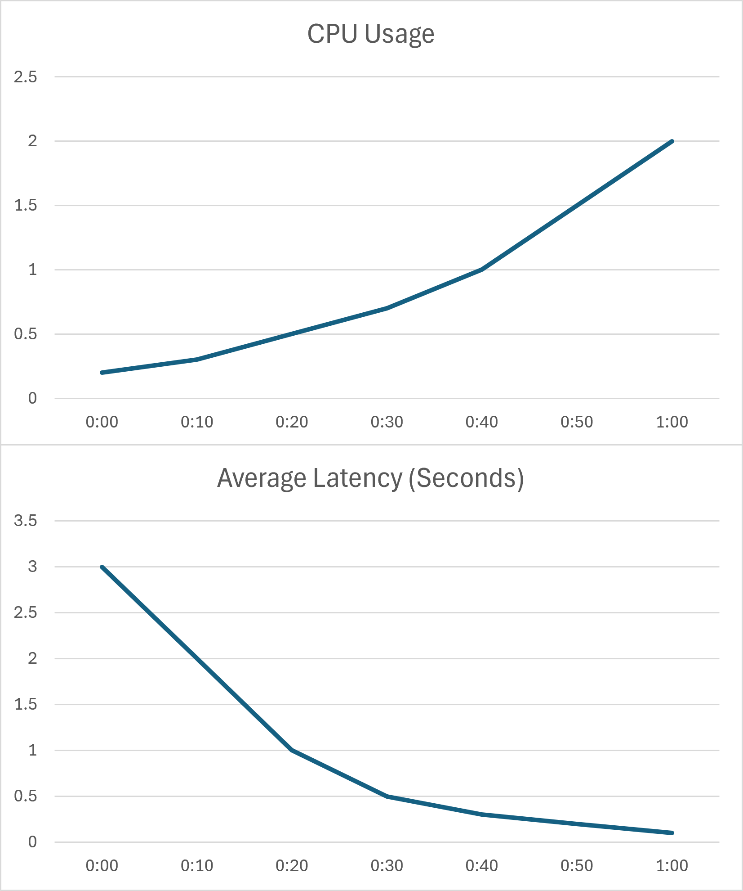
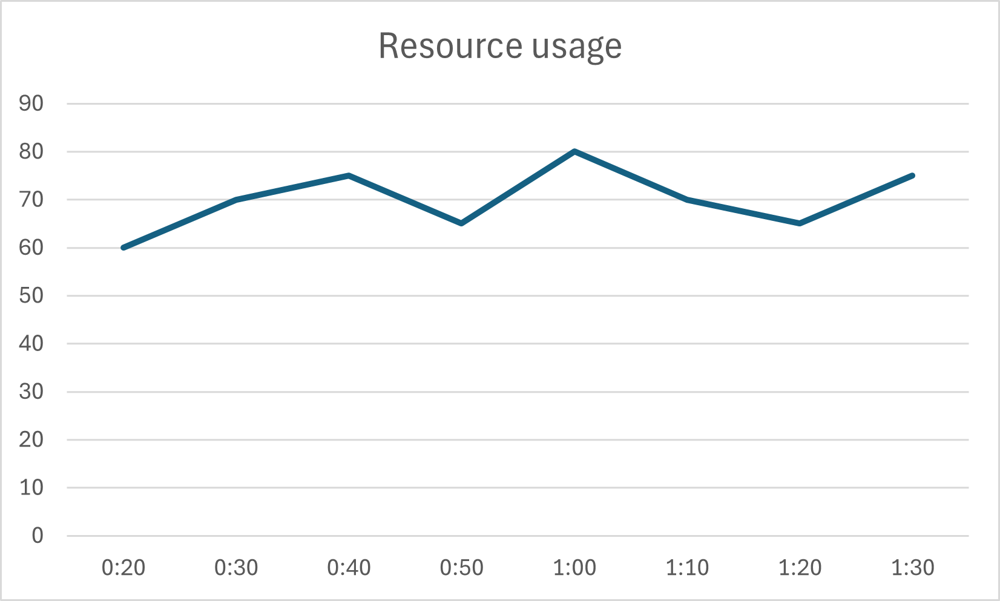

Scaling models were previously discussed
in the [Microservice]() topic.

This section aims to further clarify these concepts.
Manually scaling large systems,
which can sometimes encompass hundreds of machines and thousands of processes,
is an extremely demanding task.
This topic introduces an approach to automatic scaling.

## Vertical Scaling

Traditionally, scaling a server involves upgrading its physical or virtual hardware.
If a server lacks resources such as CPU or RAM,
more resources are allocated to it to maintain performance.

```d2
direction: right
server1: Server {
  class: server
  width: 100
  height: 100
}
server2: Scaled Server {
  class: server
  width: 200
  height: 200
}
server1 -> server2: Add 4 CPU cores
```

This approach is known as **Vertical Scaling**,
where the primary focus is on enhancing **hardware** capabilities.
When the system requires scaling,
hardware resources are treated as the units of adjustment,
for example, **adding 4 cores** or **reducing memory by 1 GB**.

## Horizontal Scaling

In this paradigm, a node (or an application instance) becomes the unit of scaling.
For instance, scaling might involve **running 5 additional nodes** or **removing 3 existing nodes**.
If a node runs out of resources, a new one is created instead of vertically upgrading the existing one.
This is known as **Horizontal Scaling**,
which focuses on the **application** rather than the underlying hardware.

[Containerization]() offers a modern approach to managing distributed systems.
A node runs an application along with its processes, and its resources are isolated and **limited**.

This means we need to carefully control the resources allocated to nodes.
For example, if we provision `1 GB of memory` for a node,
running `5 nodes` would mean provisioning a total of `5 GB of memory`.
This leads to a critical question: *how many resources does an individual node actually need?*

- **Over-provisioned**: If a node is allocated excessive resources,
it may not fully utilize them, leading to **wasted capacity**.
- **Under-provisioned**: Conversely,
nodes allocated insufficient resources will experience diminished computational power
and suffer from **degraded performance**.

In an ideal scenario,
nodes should have just enough resources to meet demand
and collectively make optimal use of all available system resources.

## Load Testing

Determining the **right size** for a node is a challenging task that requires significant expertise and effort.

**Load Testing** is a common technique employed to address this.
In essence, load testing involves simulating the production environment by
generating user requests that mimic anticipated production traffic.
Throughout this process,
it's crucial to capture how the application consumes hardware resources and how its performance metrics change over time.
The final results should demonstrate the correlations between **Hardware Metrics** (e.g., CPU usage, memory consumption) and **Application Metrics** (e.g., response time, throughput).

For example, a chart might illustrate the relationship between average latency and actual CPU usage.



Combined with the application's specific requirements (such as those defined in a [Service Level Agreement (SLA)](https://en.wikipedia.org/wiki/Service-level_agreement)),
this data helps ensure the application's performance targets can be met.
For instance, if *the application's average response time must not exceed 1 second*,
this data can help define a safe operating range for metrics like CPU usage.

## Scaling Strategies

Once a node's resource profile is configured,
the next step is to manage multiple instances of it effectively.

### Aggregate Scaling

Scaling based on the individual resource usage of each instance can be complex.
Instead, a more common approach is to use a global view that shows the aggregated usage across all instances.

```d2
grid-columns: 1
g: Global View {
    grid-gap: 0
    grid-columns: 2
    e: "Unused (35%)" {
        width: 100
        style.fill-pattern: lines
    }
    a: "Usage (65%)" {
        width: 300
        style.fill: ${colors.i1}
    }
}
i: Instances {
    m1: Instance 1 {
        grid-gap: 0
        grid-columns: 1
        a: "Usage (70%)" {
            height: 300
            style.fill: ${colors.i1}
        }
        e: "Unused (30%)" {
            height: 100
            style.fill-pattern: lines
        }
    }
    m2: Instance 2 {
        grid-gap: 0
        grid-columns: 1
        a: "Usage (60%)" {
            height: 250
            style.fill: ${colors.i1}
        }
        e: "Unused (40%)" {
            height: 150
            style.fill-pattern: lines
        }
    }
}
i.m1 -> g
i.m2 -> g
```

**Aggregate Scaling** involves defining a target range for resource utilization and allowing the aggregated usage to fluctuate around that range.
For example, the desired average CPU usage for nodes might be set between `60%` and `70%`.

- The application **scales out** (creates more nodes) if its aggregated usage exceeds `70%`, ensuring availability and performance.
- The application **scales in** (removes nodes) if its aggregated usage drops below `60%`, thereby saving resources.

The specific threshold varies, typically falling between `60%` and `80%`:

- A stable application with predictable load might require a smaller buffer (extra capacity).
- An application with unpredictable traffic that frequently experiences bursts may need a larger buffer to absorb sudden increases in demand.

An effective scaling strategy, when graphed over time, often resembles a sawtooth pattern,
characterized by sharp increases in resource allocation to meet rising demand, followed by decreases as demand subsides.



**Aggregate Scaling** is an adaptive strategy,
as the system scales in response to actual observed needs.
The primary challenge with this approach is its potential vulnerability to sudden,
sharp bursts in traffic, because provisioning new hardware and initializing nodes can be time-consuming processes.

### Scheduled Scaling

Another scaling strategy is **Scheduled Scaling**.
In this approach, the system is scaled based on predefined or predictable traffic patterns.

For instance,
if observations show that the system consistently experiences significantly higher traffic between `7 PM` and `10 PM`,
the system can be prepared in advance by proactively scaling out resources before this period to ensure a seamless user experience.
This method is particularly useful for specific use cases, such as e-commerce platforms during sales promotions or travel agencies during holiday seasons.

However, scheduled scaling can be costly,
as it often involves provisioning more resources than
the system might strictly require throughout the scheduled window.

In practice, combining aggregate and scheduled scaling is often a prudent choice.
The system can operate under **Aggregate Scaling** for normal,
adaptive adjustments, while using **Scheduled Scaling** for predictable periods of peak load.
